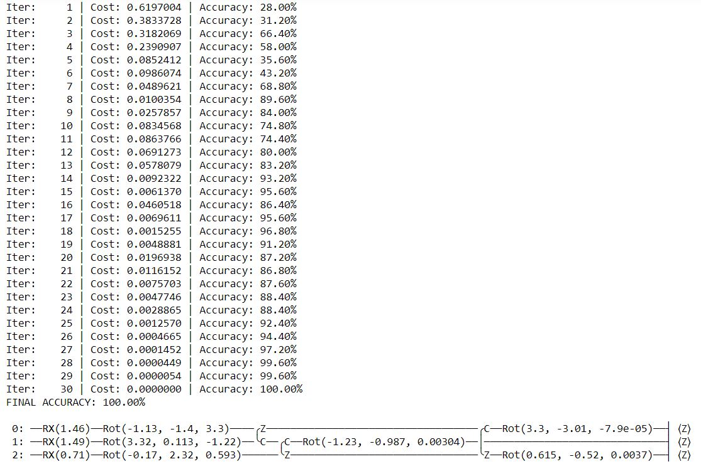

# Variational Quantum Classifier (using Pennylane Quantum language)

Variational circuits play a role in quantum machine learning akin to that of neural networks in classical machine learning. They typically have a layered structure and a set of tunable parameters that are learned through training with a classical optimization algorithm. Data is input to the circuit by embedding it into the state of a quantum device, and measurement results inform the classical optimizer how to adjust the parameters. The circuit structure, optimization method, and how data is encoded in the circuit varies heavily across algorithms, and there are often problem-specific considerations that affect how they are trained.

The below algorithm is executed in pennylane quantum language. The input of the program is the 3 dimension of the image and the labels they represent i.e. -1,0 and 1.
Whereas the output is the string of predicted labels based on the test dimension.  

## Input
The file input.in consists of 3 parts:
1. A set of training data points with dimensions (250, 3)
2. The categorical labels for the training points with dimensions (250, )
3. A set of testing data points with dimensions (50, 3)
The data has all been concatenated into a single string. 

## Output
The output of the program is a string similar to one in the file answer.ans containing the predicted labels for the testing data separated by commas.
The accuracy of 98% was achieved by using this model and a custom-built ansatz function for classifying the data.

